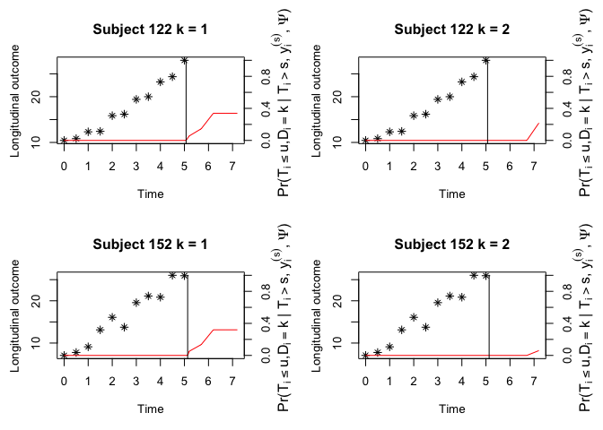

<!-- README.md is generated from README.Rmd. Please edit that file -->

# JMH

<!-- badges: start -->

[](https://github.com/shanpengli/JMH/actions/workflows/R-CMD-check.yaml)
[](https://cran.r-project.org/package=JMH)
[](https://cran.r-project.org/package=JMH)
[](https://cran.r-project.org/package=JMH)
[](https://cran.r-project.org/package=JMH)
<!-- badges: end -->

The `JMH` package jointly models both mean trajectory and within-subject
variability of the longitudinal biomarker together with the (competing
risks) survival outcome.

## Installation

You can install the development version of JMH from
[GitHub](https://github.com/) with:

``` r
# install.packages("devtools")
devtools::install_github("shanpengli/JMH")
```

# Example

The `JMH` package comes with several simulated datasets. To fit a joint
model, we use `JMMLSM` function.

``` r
library(JMH)
#> Loading required package: survival
#> Loading required package: nlme
#> Loading required package: MASS
#> Loading required package: statmod
data(ydata)
data(cdata)
## fit a joint model
fit <- JMMLSM(cdata = cdata, ydata = ydata, 
              long.formula = Y ~ Z1 + Z2 + Z3 + time,
              surv.formula = Surv(survtime, cmprsk) ~ var1 + var2 + var3,
              variance.formula = ~ Z1 + Z2 + Z3 + time, 
              quadpoint = 10, random = ~ 1|ID, print.para = FALSE)
fit
#> 
#> Call:
#>  JMMLSM(cdata = cdata, ydata = ydata, long.formula = Y ~ Z1 + Z2 + Z3 + time, surv.formula = Surv(survtime, cmprsk) ~ var1 + var2 + var3, variance.formula = ~Z1 + Z2 + Z3 + time, random = ~1 | ID, quadpoint = 10, print.para = FALSE) 
#> 
#> Data Summary:
#> Number of observations: 1353 
#> Number of groups: 200 
#> 
#> Proportion of competing risks: 
#> Risk 1 : 45.5 %
#> Risk 2 : 32.5 %
#> 
#> Numerical intergration:
#> Method: Standard Guass-Hermite quadrature
#> Number of quadrature points:  10 
#> 
#> Model Type: joint modeling of longitudinal continuous and competing risks data with the presence of intra-individual variability 
#> 
#> Model summary:
#> Longitudinal process: Mixed effects location scale model
#> Event process: cause-specific Cox proportional hazard model with non-parametric baseline hazard
#> 
#> Loglikelihood:  -3621.579 
#> 
#> Fixed effects in mean of longitudinal submodel:  Y ~ Z1 + Z2 + Z3 + time 
#> 
#>             Estimate      SE   Z value  p-val
#> (Intercept)  4.84698 0.12608  38.44257 0.0000
#> Z1           1.55464 0.16794   9.25718 0.0000
#> Z2           1.93182 0.14869  12.99221 0.0000
#> Z3           1.09675 0.05375  20.40368 0.0000
#> time         4.01091 0.02982 134.49779 0.0000
#> 
#> Fixed effects in variance of longitudinal submodel:  log(sigma^2) ~ Z1 + Z2 + Z3 + time 
#> 
#>             Estimate      SE  Z value  p-val
#> (Intercept)  0.50709 0.12929  3.92224 0.0001
#> Z1           0.49697 0.16020  3.10223 0.0019
#> Z2          -0.42588 0.13722 -3.10360 0.0019
#> Z3           0.14322 0.04478  3.19821 0.0014
#> time         0.08982 0.02420  3.71096 0.0002
#> 
#> Survival sub-model fixed effects:  Surv(survtime, cmprsk) ~ var1 + var2 + var3 
#> 
#>        Estimate      SE Z value  p-val
#> var1_1  1.09299 0.32464 3.36674 0.0008
#> var2_1  0.18821 0.25961 0.72499 0.4685
#> var3_1  0.49715 0.08888 5.59365 0.0000
#>                                        
#> var1_2 -0.88281 0.33776 -2.61374 0.0090
#> var2_2  0.81281 0.30323  2.68049 0.0074
#> var3_2  0.20826 0.09304  2.23835 0.0252
#> 
#> Association parameters:                 
#>               Estimate      SE  Z value  p-val
#> (Intercept)_1  0.97446 0.61369  1.58788 0.1123
#> (Intercept)_2 -0.19134 0.46404 -0.41232 0.6801
#> Residual_1     0.48845 0.57384  0.85120 0.3947
#> Residual_2    -0.84748 0.51612 -1.64201 0.1006
#> 
#> 
#> Random effects:                 
#>   Formula: ~1 | ID 
#>                      Estimate      SE Z value  p-val
#> (Intercept)           0.50147 0.11280 4.44558 0.0000
#> (Intercept):Residual  0.26414 0.07806 3.38394 0.0007
#> Residual              0.45483 0.11156 4.07680 0.0000
```

The `JMH` package can make dynamic prediction given the longitudinal
history information. Below is a toy example for competing risks data.
Conditional cumulative incidence probabilities for each failure will be
presented.

``` r
cnewdata <- cdata[cdata$ID %in% c(122, 952), ]
ynewdata <- ydata[ydata$ID %in% c(122, 952), ]
survfit <- survfitJMMLSM(fit, seed = 100, ynewdata = ynewdata, cnewdata = cnewdata, 
                         u = seq(5.2, 7.2, by = 0.5), Last.time = "survtime",
                         obs.time = "time", method = "GH")
survfit
#> 
#> Prediction of Conditional Probabilities of Event
#> based on the standard Guass-Hermite quadrature rule with 10 quadrature points
#> $`122`
#>      times       CIF1      CIF2
#> 1 5.069089 0.00000000 0.0000000
#> 2 5.200000 0.05603594 0.0000000
#> 3 5.700000 0.14598868 0.0000000
#> 4 6.200000 0.33890999 0.0000000
#> 5 6.700000 0.33890999 0.0000000
#> 6 7.200000 0.33890999 0.2174255
oldpar <- par(mfrow = c(2, 2), mar = c(5, 4, 4, 4))
plot(survfit, include.y = TRUE)
par(oldpar)
```



To assess the prediction accuracy of the fitted joint model, we may run
`PEJMMLSM` to calculate the Brier score.

``` r
PE <- PEJMMLSM(fit, seed = 100, landmark.time = 3, horizon.time = c(4:6),
               obs.time = "time", method = "GH", 
               n.cv = 3)
#> The 1 th validation is done!
#> The 2 th validation is done!
#> The 3 th validation is done!
summary(PE, error = "Brier")
#> 
#> Expected Brier Score at the landmark time of 3 
#> based on 3 fold cross validation
#>   Horizon Time Brier Score 1 Brier Score 2
#> 1            4    0.06966073    0.06858532
#> 2            5    0.10855519    0.11314804
#> 3            6    0.22845151    0.11524867
```

An alternative to assess the prediction accuracy is to run `MAEQJMMLSM`
to calculate the prediction error by comparing the predicted and
empirical risks stratified on different risk groups based on quantile of
the predicted risks.

``` r
## evaluate prediction accuracy of fitted joint model using cross-validated mean absolute prediction error
MAEQ <- MAEQJMMLSM(fit, seed = 100, landmark.time = 3, 
                   horizon.time = c(4:6), 
                   obs.time = "time", method = "GH", n.cv = 3)
#> The 1 th validation is done!
#> The 2 th validation is done!
#> The 3 th validation is done!
summary(MAEQ)
#> 
#> Sum of absolute error across quintiles of predicted risk scores at the landmark time of 3 
#> based on 3 fold cross validation
#>   Horizon Time  CIF1  CIF2
#> 1            4 0.356 0.244
#> 2            5 0.406 0.374
#> 3            6 0.804 0.375
```
